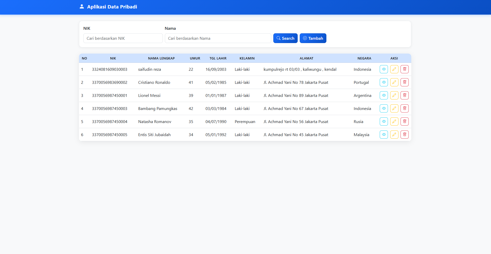
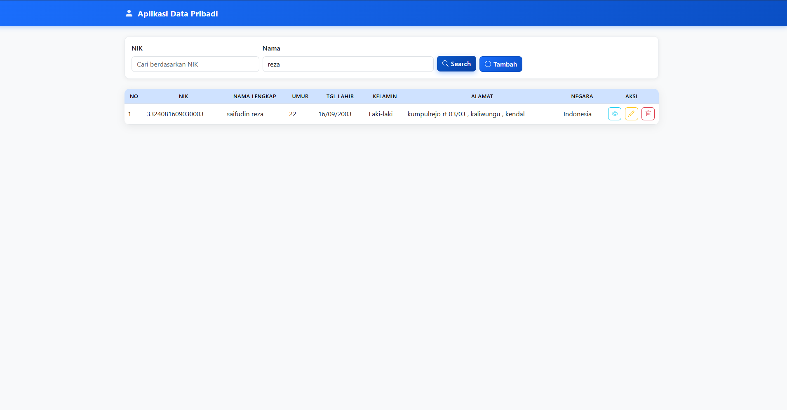
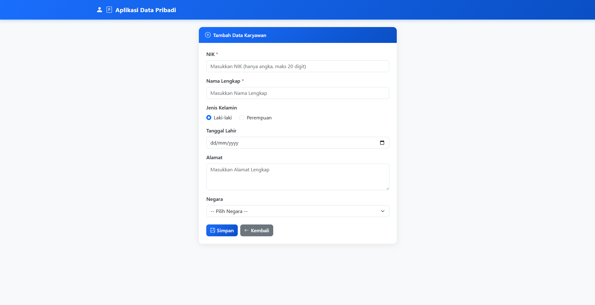
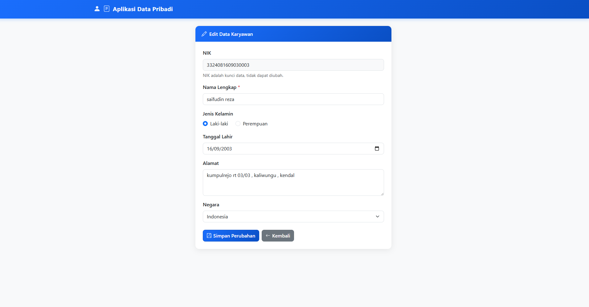
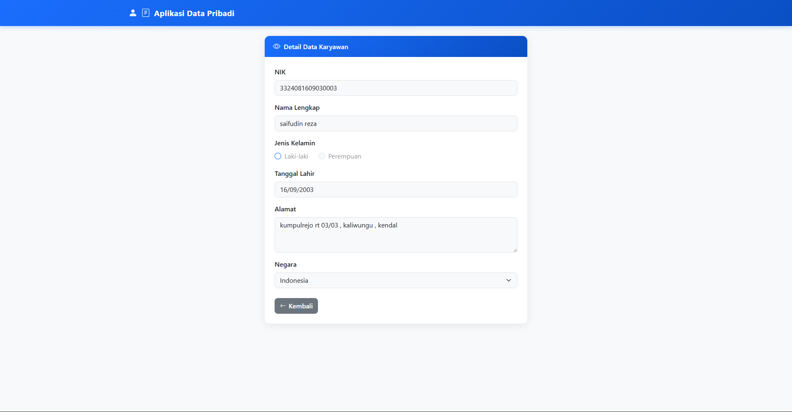

# Aplikasi Data Pribadi Karyawan

Aplikasi web CRUD untuk manajemen data karyawan, dibangun dengan **Spring Boot 3** (REST API) dan **HTML/CSS/JavaScript** (frontend), terhubung ke **MySQL** sebagai database.

---

## Tech Stack

| Layer | Teknologi |
|-------|-----------|
| Backend | Java 17, Spring Boot 3.2.3, Spring Data JPA, Hibernate 6.4 |
| Frontend | HTML5, Bootstrap 5.3, jQuery 3.7 (AJAX) |
| Database | MySQL 8+ |
| Build Tool | Maven 3.9+ |

---

## Fitur

- **CRUD Lengkap** — tambah, lihat, edit, dan hapus data karyawan
- **Pencarian** — filter berdasarkan NIK (exact) atau nama (partial, case-insensitive)
- **Kalkulasi Umur Otomatis** — dihitung dari tanggal lahir setiap request, tidak disimpan di DB
- **Validasi Input** — NIK wajib angka, tidak boleh duplikat, nama wajib diisi
- **Global Error Handling** — semua error dikembalikan dalam format JSON yang konsisten
- **Seed Data** — 5 data karyawan contoh langsung tersedia saat pertama kali dijalankan

---

## Arsitektur

Menggunakan arsitektur **berlapis (layered architecture)** dengan pemisahan tanggung jawab yang jelas:

```
Browser (HTML + JS)
    ↕ HTTP / JSON
Controller  →  Service  →  Repository  →  MySQL
```

- **Controller** — menerima HTTP request, validasi input dengan `@Valid`
- **Service** — logika bisnis: cek duplikasi NIK, kalkulasi umur, konversi Entity ↔ DTO
- **Repository** — operasi database via Spring Data JPA + custom JPQL query
- **DTO Pattern** — `RequestDTO` untuk input (dengan Bean Validation), `ResponseDTO` untuk output (menyertakan field kalkulasi `umur`)

---

## Cara Menjalankan

**Prasyarat:** Java 17, Maven, MySQL 8+

```sql
-- 1. Buat database
CREATE DATABASE db_datapribadi;
```

```properties
# 2. Sesuaikan kredensial di aplikasi-data-pribadi/src/main/resources/application.properties
spring.datasource.username=root
spring.datasource.password=password_kamu
```

```bash
# 3. Jalankan aplikasi
cd aplikasi-data-pribadi
mvn spring-boot:run
```

```
# 4. Buka di browser
http://localhost:8080
```

> Tabel `karyawan` dibuat otomatis oleh Hibernate (`ddl-auto=update`). Seed data dari `data.sql` langsung tersedia.

---

## API Endpoints

Base URL: `http://localhost:8080`

| Method | Endpoint | Deskripsi |
|--------|----------|-----------|
| `GET` | `/api/karyawan` | Ambil semua karyawan (support filter `?nik=` & `?nama=`) |
| `GET` | `/api/karyawan/{nik}` | Ambil 1 karyawan berdasarkan NIK |
| `POST` | `/api/karyawan` | Tambah karyawan baru |
| `PUT` | `/api/karyawan/{nik}` | Update data karyawan |
| `DELETE` | `/api/karyawan/{nik}` | Hapus karyawan |

**Format response:**
```json
{ "status": "success", "data": { ... } }
{ "status": "error", "message": "NIK sudah terdaftar" }
```

---

## Struktur Project

```
aplikasi-data-pribadi/
├── pom.xml
└── src/main/
    ├── java/com/app/datapribadi/
    │   ├── DataPribadiApplication.java
    │   ├── entity/Karyawan.java
    │   ├── dto/
    │   │   ├── KaryawanRequestDTO.java
    │   │   └── KaryawanResponseDTO.java
    │   ├── repository/KaryawanRepository.java
    │   ├── service/KaryawanService.java
    │   ├── controller/KaryawanController.java
    │   └── exception/GlobalExceptionHandler.java
    └── resources/
        ├── application.properties
        ├── data.sql
        └── static/
            ├── index.html
            ├── tambah.html
            ├── edit.html
            ├── detail.html
            ├── css/style.css
            └── js/
                ├── api.js
                ├── monitoring.js
                └── form.js
```

---

## Tampilan Aplikasi

### Dashboard — Daftar Karyawan



### Pencarian Karyawan



### Form Tambah Karyawan



### Form Edit Karyawan



### Detail Karyawan



---

*Technical Test — Spring Boot 3 + MySQL + Bootstrap 5*
